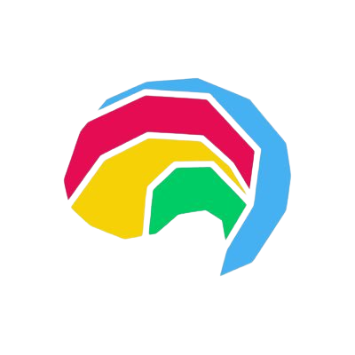

<b>Schematics Bootcamp and Seminar of Technology 2023</b>

<a href="https://schematics-its.com/">Schematics ITS 2023</a>

  

<a href="https://schematics-its.com/bst">Schematics Bootcamp and Seminar of Technology (Schematics BST)</a> is one of a series of Schematics 2023 events that we present to become a forum for training and education about the world of technology and its developments, as well as how this technology has an impact on life and various sectors in Indonesia.

The <a href="https://its.id/m/HackerrankBootcamp">practice problems</a> were solved by <a href="https://github.com/aleahfaa">Iffa Amalia</a> and the <a href="https://its.id/m/SoalFP">Final project (Question 6)</a> were solved by Group 21

